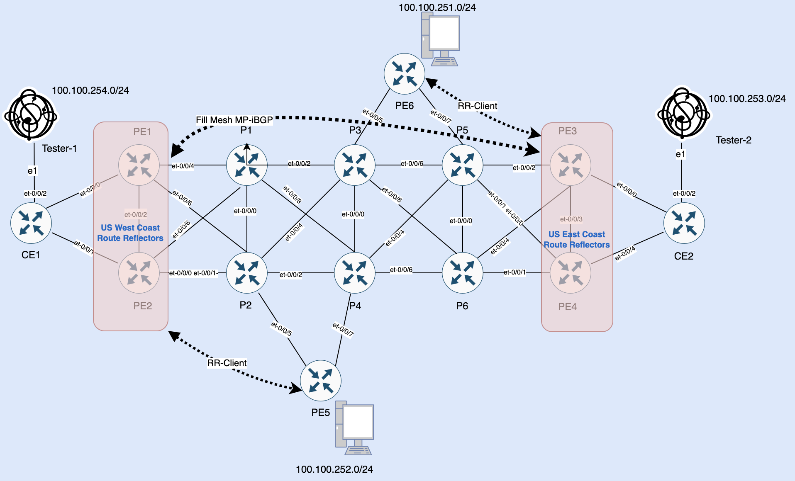

# Understanding-BGP-Route-Reflector-Mysteries
In this blog we will learn the functionality of BGP Route Reflectors (RR) and BGP attributes set by RR while sending BGP updates. BGP RR is used to avoid need of having full mesh IBGP peers thus helps in network scalability  and besides that RR sets BGP attributes which are inspected by receiving  router to avoid network loops. 

## BGP Route Reflection Rules 
* Any route received from RR client is re-advertised to non-client iBPG Peers, eBPG peers and other RR clients.
* Any route received by non-client IBGP Peer or eBGP peers will be re-advertised to non-client iBGP peers  , other eBGP peers and RR clients. 

## BGP Attributes Adjusted by RR
* From IBGP learned routes , RR sets the Cluster ID and Origin ID before sending those routes to non-client IBGP peers or RR Client peers. 
* Cluster ID and Origin ID are not set for eBGP learned routes or static/ direct routes being re-distribuited by RR to non-client IBGP peer or Client IBPG peer . 
* Cluster ID and Origin ID are not set by the RR while sending routes to eBGP peers.

## Loop Avoidance Mechansim 
* If a router receives a route that has an origin ID equivalent to its own router ID, then that route will be discarded.
* If a RR receives a route that has Cluster ID  as per receiving RR Cluster ID then that route will be discarded. 

## Lab Topolopy 
Our lab topology is as under:-


In our lab topology, we have 2 RRs in US West Coast (PE1 & PE2) with 1 client i.e PE5 and 2 RRs in US East Coast (PE3 & PE4) with 1 client i.e PE6.  We will take the example of PE6 subnet i.e 100.100.251.0/24 and will explore this subnet is being handled in our lab topology.

Enough theory, let's explore our lab and see what is happening there. 

PE6 is RR client with US East Coast Route Reflectors i.e PE3 (172.172.172.9 ) and PE4 (172.172.172.10), PE6 is sending 1 subnet to it's RR. 

```
root@PE6> show route advertising-protocol bgp 172.172.172.9 extensive 


prod.inet.0: 5 destinations, 18 routes (5 active, 0 holddown, 0 hidden)
* 100.100.251.0/24 (1 entry, 1 announced)
 BGP group rr type Internal
     Route Distinguisher: 172.172.172.11:65000
     VPN Label: 16
     Nexthop: Self
     Flags: Nexthop Change
     Localpref: 100
     AS path: [65000] I 
     Communities: target:65000:100

root@PE6> show route advertising-protocol bgp 172.172.172.10 extensive   

prod.inet.0: 5 destinations, 18 routes (5 active, 0 holddown, 0 hidden)
* 100.100.251.0/24 (1 entry, 1 announced)
 BGP group rr type Internal
     Route Distinguisher: 172.172.172.11:65000
     VPN Label: 16
     Nexthop: Self
     Flags: Nexthop Change
     Localpref: 100
     AS path: [65000] I 
     Communities: target:65000:100
```
Once the PE6 subnet i.e 100.100.251.0/24 is is receievd on it's RR i.e (PE3 and PE4) that subnet has to be sent to US West Coast RR i.e (PE1 and PE2) as there is full mesh iBGP sessions are configured between US East Cosst RRs  and US West Coast RR .  US East Coast RRs will set cluster ID and Origin ID attributes with PE6 subnet, cluster ID value would be what ever is configured on US East Coas RRs and Origin ID would be vlaue of PE6 loopback IP (which is originator of the route). 


```
root@PE3> show bgp summary group rr-client 

Threading mode: BGP I/O
Default eBGP mode: advertise - accept, receive - accept
Groups: 3 Peers: 5 Down peers: 0
Table          Tot Paths  Act Paths Suppressed    History Damp State    Pending
bgp.l3vpn.0          
                      10          7          0          0          0          0
bgp.evpn.0           
                       1          1          0          0          0          0
Peer                     AS      InPkt     OutPkt    OutQ   Flaps Last Up/Dwn State|#Active/Received/Accepted/Damped...
172.172.172.14        65000       2469     135469       1       0    18:31:15 Establ
  bgp.l3vpn.0: 1/1/1/0
  prod.inet.0: 1/1/1/0


root@PE3> show route receive-protocol bgp 172.172.172.14 extensive table prod.inet.0 
prod.inet.0: 6 destinations, 15 routes (6 active, 0 holddown, 0 hidden)
* 100.100.251.0/24 (1 entry, 1 announced)
     Import Accepted
     Route Distinguisher: 172.172.172.14:65000
     VPN Label: 16
     Nexthop: 172.172.172.14
     Localpref: 100
     AS path: I 
     Communities: target:65000:100

```

In above snippet, we can see that on PE3 (which is one of the RRs in US East Cost), subnet 100.100.251.0/24 is being received from 172.172.172.14, i.e., PE6. Now let's analyse how this route is being re-advertised to eBGP peer and IBGP peer. First, let's analyse IBGP peer re-advertising.


```
root@PE3> show route advertising-protocol bgp 172.172.172.1 table bgp.l3vpn.0 next-hop 172.172.172.14 extensive 

bgp.l3vpn.0: 8 destinations, 11 routes (8 active, 0 holddown, 0 hidden)
* 172.172.172.14:65000:100.100.251.0/24 (1 entry, 1 announced)
 BGP group mpls-bb type Internal
     Route Distinguisher: 172.172.172.14:65000
     VPN Label: 17
     Nexthop: 172.172.172.14
     Localpref: 100
     AS path: [65000] I 
     Communities: target:65000:100
     Cluster ID: 2.2.2.2
     Originator ID: 172.172.172.14

```
In above snippet , we can see that PE3  is adding Cluster ID i.e 2.2.2.2 and Originator ID i.e 172.172.172.14 while re-advertising subnet 100.100.251.0/2 to one of it's IBGP peer i.e 172.172.172.1. Now let's inspect same route being re-advertised by PE3 to CE2 over eBPG peering.


```
root@PE3> show bgp summary group to-CE

Threading mode: BGP I/O
Default eBGP mode: advertise - accept, receive - accept
Groups: 3 Peers: 5 Down peers: 0
Table          Tot Paths  Act Paths Suppressed    History Damp State    Pending
bgp.l3vpn.0          
                      10          7          0          0          0          0
bgp.evpn.0           
                       1          1          0          0          0          0
Peer                     AS      InPkt     OutPkt    OutQ   Flaps Last Up/Dwn State|#Active/Received/Accepted/Damped...
100.100.100.4         65110       3257       3114       0       1  1d 0:28:24 Establ
  prod.inet.0: 1/1/1/0


root@PE3> show route advertising-protocol bgp 100.100.100.4 match-prefix 100.100.251.0/24 extensive 

prod.inet.0: 6 destinations, 15 routes (6 active, 0 holddown, 0 hidden)
* 100.100.251.0/24 (1 entry, 1 announced)
 BGP group to-CE1 type External
     Nexthop: Self
     AS path: [65000] I 
     Communities: target:65000:100
```

In above snippet, we can see that Cluster ID and Origin ID are not set by RR i.e PE3 while sending subnet 100.100.251.0/24 to eBGP peer towards CE2.


```
root@PE3> show route advertising-protocol bgp 172.172.172.10 table bgp.l3vpn.0 extensive 

bgp.l3vpn.0: 8 destinations, 11 routes (8 active, 0 holddown, 0 hidden)
* 172.172.172.9:100:100.100.253.0/24 (1 entry, 1 announced)
 BGP group mpls-bb type Internal
     Route Distinguisher: 172.172.172.9:100
     VPN Label: 42972
     Nexthop: Self
     Flags: Nexthop Change
     Localpref: 100
     AS path: [65000] 65110 I 
     Communities: target:65000:100

* 172.172.172.14:65000:100.100.251.0/24 (1 entry, 1 announced)
 BGP group mpls-bb type Internal
     Route Distinguisher: 172.172.172.14:65000
     VPN Label: 17
     Nexthop: 172.172.172.14
     Localpref: 100
     AS path: [65000] I 
     Communities: target:65000:100
     Cluster ID: 2.2.2.2
     Originator ID: 172.172.172.14


root@PE4> show route receive-protocol bgp 172.172.172.9 table bgp.l3vpn.0 

bgp.l3vpn.0: 8 destinations, 11 routes (8 active, 0 holddown, 0 hidden)
  Prefix                  Nexthop              MED     Lclpref    AS path
  172.172.172.9:100:100.100.253.0/24                    
*                         172.172.172.9                100        65110 I
```

In the above snippet, we can see that PE3 is sending two routes towards PE4 (i.e., 2nd RR in US East Cost). With the prefix 172.172.172.14:65000:100.100.251.0/24.  Cluster ID and Originator ID are set by PE3. Now if we re-call Originator ID, 172.172.172.14 is the router ID of PE6, which is the originator of subnet 100.100.251.0/24 and RR Client to both PE3 and PE4. Now if we look at PE4 for routes received from PE3, we don't see prefix 172.172.172.14:65000:100.100.251.0/24 being received on PE4, even though it's re-advertised by PE3 towards PE4. Any guess why it is not being received on PE4? because PE3 sets Cluster ID, i.e., 2.2.2.2, which is equal to the Cluter ID configured on PE4, so PE4 will discard it.
 
